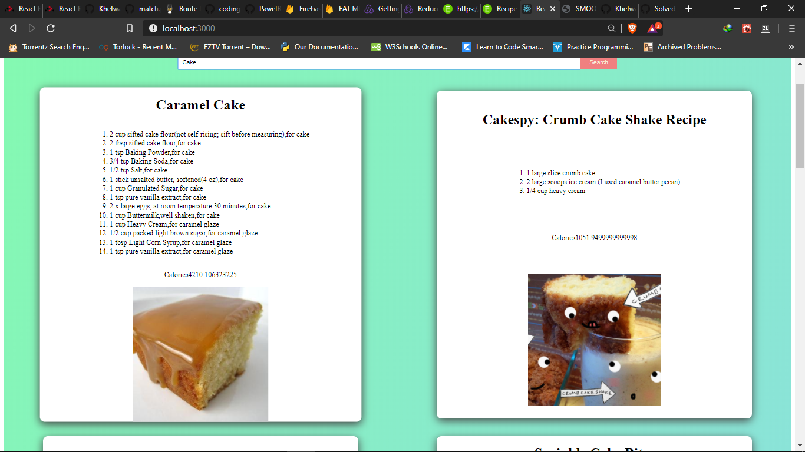

1. Simple use of useEffect 

```js
import React, { useEffect, useState } from 'react';
import './App.css';


const App = () => {

  const APP_ID = 'e0047c7b';
  const APP_KEY = 'ee5c3abbbd3227546403dc5a08b55cd6';
  const exampleReq = `https://api.edamam.com/search?q=chicken&app_id=${APP_ID}&app_key=${APP_KEY}`;

  const [counter, setCounter] = useState(0);


  useEffect(() => {
    console.log(' Effected');
  }, [])


  const getRecipes = async () => {
     const 
  }


  return (
    <div className="App">
      <h1 onClick={() => setCounter(counter + 1)}>This is the header one</h1>
      <form className="search-form">
        <input className="search-bar" type="submit" />
        {counter}
        <button className="search-button" type="submit">Search</button>
      </form>
    </div>
  )
}


export default App;

```


2. This is  enough

```js
import React, { useEffect, useState } from 'react';
import './App.css';


const App = () => {

  const APP_ID = "e0047c7b";
  const APP_KEY = "fe9b2ce78ec7f5216b08797824052d1d";


  useEffect(() => {

    getRecipes();
    console.log(' Effected');
  }, [])


  const getRecipes = async () => {
    const response = await fetch(`https://api.edamam.com/search?q=chicken&app_id=${APP_ID}&app_key=${APP_KEY}`);
    const data = await response.json();
    console.log(data);


  }


  return (
    <div className="App">
      <h1> como estas</h1>
      <form className="search-form">
        <input className="search-bar" type="submit" />
        <button className="search-button" type="submit">Search</button>
      </form>
    </div>
  )
}


export default App;

```


3. This will print the title

```js
import React, { useEffect, useState } from 'react';
import './App.css';
import Recipe from './Recipe';


const App = () => {

  const APP_ID = "e0047c7b";
  const APP_KEY = "fe9b2ce78ec7f5216b08797824052d1d";

  const [recipes, setRecipes] = useState([]);

  useEffect(() => {

    getRecipes();
    console.log(' Effected');
  }, []);


  const getRecipes = async () => {
    const response = await fetch(`https://api.edamam.com/search?q=chicken&app_id=${APP_ID}&app_key=${APP_KEY}`);
    const data = await response.json();
    console.log(data);
    console.log('***************');
    console.log(data.hits);
    setRecipes(data.hits);


  };


  return (
    <div className="App">
      <h1> como estas </h1>
      <form className="search-form">
        <input className="search-bar" type="submit" />
        <button className="search-button" type="submit">Search</button>
      </form>
      {recipes.map(recipe => (
        <Recipe />
      ))}
    </div>
  )
}


export default App;

```


4. It's working

```js
import React from 'react';


const Recipe = ({ title, calories, image }) => {
    return (
        <div>
            <h1> Hey ... Title{title}</h1>
            <p>Calories{calories}</p>
            
        </div>
    )
}

export default Recipe;
```


### Each child in a list should have a unique "key" prop.


```js
import React from 'react';


const Recipe = ({ title, calories, image }) => {
    return (
        <div>
            <h1> Hey ... Title{title}</h1>
            <p>Calories{calories}</p>
            
        </div>
    )
}

export default Recipe;
```


5. Creating the state, As I click the state changes

```js
import React, { useEffect, useState } from 'react';
import './App.css';
import Recipe from './Recipe';


const App = () => {

  const APP_ID = "e0047c7b";
  const APP_KEY = "fe9b2ce78ec7f5216b08797824052d1d";

  const [recipes, setRecipes] = useState([]);
  const [search, setSearch] = useState('');
  useEffect(() => {

    getRecipes();
    console.log(' Effected');
  }, []);


  const getRecipes = async () => {
    const response = await fetch(`https://api.edamam.com/search?q=chicken&app_id=${APP_ID}&app_key=${APP_KEY}`);
    const data = await response.json();
    console.log(data);
    console.log('***************');
    console.log(data.hits);
    setRecipes(data.hits);


  };


  const updateSearch = e => {
    setSearch(e.target.value);
    console.log(search);
  }

  return (
    <div className="App">
      <h1> como estas </h1>
      <form className="search-form">
        <input className="search-bar" type="text" value={search} onChange={updateSearch} />
        <button className="search-button" type="submit">Search</button>
      </form>
      {recipes.map(recipe => (
        <Recipe key={recipe.recipe.label} title={recipe.recipe.label} calories={recipe.recipe.calories} image={recipe.recipe.image} />
      ))}
    </div>
  )
}


export default App;

```


6. The number of requests made can be seen in console.

```js
import React, { useEffect, useState } from 'react';
import './App.css';
import Recipe from './Recipe';


const App = () => {

  const APP_ID = "e0047c7b";
  const APP_KEY = "fe9b2ce78ec7f5216b08797824052d1d";

  const [recipes, setRecipes] = useState([]);
  const [search, setSearch] = useState('');
  useEffect(() => {

    getRecipes();
    console.log(' Effected');
    console.log('save our fetching data');
  }, [search]);


  const getRecipes = async () => {
    const response = await fetch(`https://api.edamam.com/search?q=chicken&app_id=${APP_ID}&app_key=${APP_KEY}`);
    const data = await response.json();
    console.log(data);
    console.log('***************');
    console.log(data.hits);
    setRecipes(data.hits);


  };


  const updateSearch = e => {
    setSearch(e.target.value);
    console.log(search);
  }

  return (
    <div className="App">
      <h1> como estas </h1>
      <form className="search-form">
        <input className="search-bar" type="text" value={search} onChange={updateSearch} />
        <button className="search-button" type="submit">Search</button>
      </form>
      {recipes.map(recipe => (
        <Recipe key={recipe.recipe.label} title={recipe.recipe.label} calories={recipe.recipe.calories} image={recipe.recipe.image} />
      ))}
    </div>
  )
}


export default App;

```


7. Retrieving  the data on search

```js
import React, { useEffect, useState } from 'react';
import './App.css';
import Recipe from './Recipe';


const App = () => {

  const APP_ID = "b6605271";
  const APP_KEY = "ab33784f98db1504cfa6858a2b42712b";

  const [recipes, setRecipes] = useState([]);
  const [search, setSearch] = useState("");
  const [query, setQuery] = useState('chicken');
  useEffect(() => {

    getRecipes();
    console.log(' Effected');
    console.log('save our fetching data');
  }, [query]);


  const getRecipes = async () => {
    const response = await fetch(`https://api.edamam.com/search?q=${query}&app_id=${APP_ID}&app_key=${APP_KEY}`);
    const data = await response.json();
    console.log(data);
    console.log('***************');
    console.log(data.hits);
    setRecipes(data.hits);


  };


  const updateSearch = e => {
    setSearch(e.target.value);
    console.log(search);
    // setSearch('');
  }


  const getSearch = e => {
    e.preventDefault();
    setQuery(search);
  }

  return (
    <div className="App">
      <h1> como estas</h1>
      <form onSubmit={getSearch} className="search-form">
        <input type="text" className="search-bar" value={search} onChange={updateSearch} />
        <button className="search-button" type="submit">Search</button>
      </form>
      {recipes.map(recipe => (
        <Recipe key={recipe.recipe.label} title={recipe.recipe.label} calories={recipe.recipe.calories} image={recipe.recipe.image} />
      ))}
    </div>
  )
}


export default App;

```


8. The final part

```js
import React, { useEffect, useState } from 'react';
import './App.css';
import Recipe from './Recipe';


const App = () => {

  const APP_ID = "b6605271";
  const APP_KEY = "ab33784f98db1504cfa6858a2b42712b";

  const [recipes, setRecipes] = useState([]);
  const [search, setSearch] = useState("");
  const [query, setQuery] = useState('chicken');
  useEffect(() => {

    getRecipes();
    console.log(' Effected');
    console.log('save our fetching data');
  }, [query]);


  const getRecipes = async () => {
    const response = await fetch(`https://api.edamam.com/search?q=${query}&app_id=${APP_ID}&app_key=${APP_KEY}`);
    const data = await response.json();
    console.log(data);
    console.log('***************');
    console.log(data.hits);
    setRecipes(data.hits);


  };


  const updateSearch = e => {
    setSearch(e.target.value);
    console.log(search);
    // setSearch('');
  }


  const getSearch = e => {
    e.preventDefault();
    setQuery(search);
  }

  return (
    <div className="App">
      <h1> como estas</h1>
      <form onSubmit={getSearch} className="search-form">
        <input type="text" className="search-bar" value={search} onChange={updateSearch} />
        <button className="search-button" type="submit">Search</button>
      </form>
      {recipes.map(recipe => (
        <Recipe
          key={recipe.recipe.label}
          title={recipe.recipe.label}
          calories={recipe.recipe.calories}
          image={recipe.recipe.image}
          ingredients={recipe.recipe.ingredients}
        />
      ))}
    </div>
  )
}


export default App;

```


9. CSS

 1. App.css

```.App{
  min-height: 100vh;
  background-image: linear-gradient(120deg, #84fab0 0%, #8fd3f4 100%);

}


.search-form{
  min-height: 10vh;
  display: flex;
  justify-content: center;
  align-items: center;
}


.search-bar{
  width: 50%;
  border: none;
  padding: 10px;
}


.search-button{
  background:lightcoral;
  border:none;
  padding: 10px 20px;
  color: antiquewhite;
}


.recipes{
  display: flex;
  justify-content: space-around;
  flex-wrap: wrap;
}


.header{
  min-height: 10vh;
  display: flex;
  justify-content: center;
  align-items: center;
}
```


 2. recipe.module.css

```css

.recipe{
    border-radius: 11px;
    box-shadow: 0px 5px 20px rgb(71,71,71);
    margin: 20px;
    display: flex;
    flex-direction: column;
    justify-content: space-around;
    background:white;
    align-items: center;
    min-width: 40%;
    cursor: pointer;
    transition: transform .5s ease;
}

.recipe:hover{
    transform: scale(1.02);
}


```


---


# Final code

---


1. App.js

```js
import React, { useEffect, useState } from 'react';
import './App.css';
import Recipe from './Recipe';


const App = () => {

  const APP_ID = "b6605271";
  const APP_KEY = "ab33784f98db1504cfa6858a2b42712b";

  const [recipes, setRecipes] = useState([]);
  const [search, setSearch] = useState("");
  const [query, setQuery] = useState('burger');
  useEffect(() => {

    getRecipes();
    console.log(' Effected');
    console.log('save our fetching data');
  }, [query]);


  const getRecipes = async () => {
    const response = await fetch(`https://api.edamam.com/search?q=${query}&app_id=${APP_ID}&app_key=${APP_KEY}`);
    const data = await response.json();
    console.log(data);
    console.log('***************');
    console.log(data.hits);
    setRecipes(data.hits);


  };


  const updateSearch = e => {
    setSearch(e.target.value);
    console.log(search);
    // setSearch('');
  }


  const getSearch = e => {
    e.preventDefault();
    setQuery(search);
  }

  return (
    <div className="App">
      <h1 className="header"> COMO ESTAS DevEd</h1>
      <form onSubmit={getSearch} className="search-form">
        <input type="text" className="search-bar" value={search} onChange={updateSearch} />
        <button className="search-button" type="submit">Search</button>
      </form>
      <div className="recipes">
        {recipes.map(recipe => (
          <Recipe
            key={recipe.recipe.label}
            title={recipe.recipe.label}
            calories={recipe.recipe.calories}
            image={recipe.recipe.image}
            ingredients={recipe.recipe.ingredients}
          />
        ))}
      </div>
    </div>

  )
}


export default App;

``` 


2. Recipe.js

```js
import React from 'react';
import style from './recipe.module.css';


const Recipe = ({ title, calories, image, ingredients }) => {
    return (
        <div className={style.recipe}>
            <h1>{title}</h1>
            <ol>
                {ingredients.map(ingredient => (
                    <li>{ingredient.text}</li>
                ))}
            </ol>

            <p>Calories{calories}</p>
            
        </div>
    )
}

export default Recipe;
```

